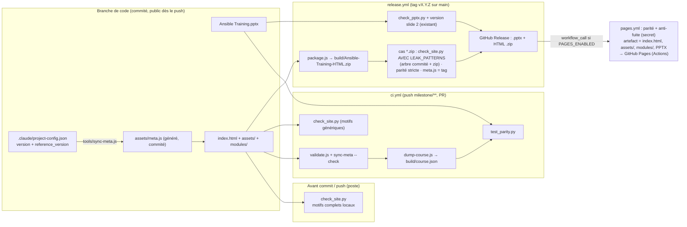
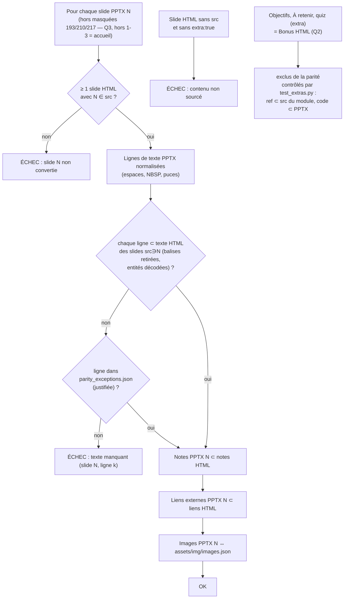

<!--
  composant : build-publish (sources commitées → contrôles → release / hébergement optionnel)
  feature   : version HTML du support + exigence permanente PPTX+HTML (#3, #5)
  version   : 0.2.0
  type      : architecture
  issue     : #3, #5
  complete  : aucune
  remplace  : aucune (révision 2 du brouillon : hébergement Q1 décidé = Pages via Actions à chaque release)
-->

# Architecture — site commité, contrôles, release, hébergement optionnel

## 1. Arborescence (branche de code `milestone/v0.2.0` → `main`) — calquée sur le cours OpenShift

```
/                                    racine du dépôt (PUBLIC)
├── index.html                       [main]   coquille du site, 1 <script> par module
├── assets/
│   ├── engine.js                    [main]   moteur porté d'OpenShift (MIT) + notes, img, src, extra
│   ├── plan.js                      [main]   manifeste COURSE.plan (15 modules, champ day)
│   ├── style.css                    [main]   thème bleu, clair/sombre
│   ├── meta.js                      [gén.+commité]  version, reference_version, date ← tools/sync-meta.js
│   └── img/  *.png, images.json     [extrait+commité] depuis le PPTX (dev-slides)
├── modules/
│   ├── m01-introduction.js          [main]   COURSE.add({…, slides:[{src:[4], …}]})
│   ├── m02-inventory.js             [main]   (pilote)
│   └── … m15-automation-integration.js
├── tools/
│   ├── validate.js                  [main]   schéma + cohérence plan/index/modules
│   ├── sync-meta.js                 [main]   écrit / vérifie (--check) assets/meta.js
│   ├── dump-course.js               [main]   → build/course.json (non commité)
│   ├── package.js                   [main]   → build/Ansible-Training-HTML.zip (non commité, déterministe)
│   └── check_links.py               [main]   liens : --offline (tests) / --online débit limité (manuel)
├── CONVENTIONS.md                   [main]   schéma, blocs, règles de conversion, statut des fichiers
├── Ansible Training.pptx            [main]   support PPTX (inchangé de rôle ; référence de parité)
├── README.md, CHANGELOG.md          [main]   existants, coexistent (comme OpenShift)
├── docs/  PLAN.md, PROCESS-PPTX-HTML.md, mockup/
├── tests/
│   ├── slides/                      existant (PPTX : anti-fuite, obsolescence)
│   ├── site/                        NOUVEAU : parité, check_site.py, meta, liens, package, hygiène
│   └── procedures/site/             NOUVEAU : revue visuelle, hébergement
├── build/                           [ignoré]  course.json, zip, img-contact.html
└── .github/workflows/
    ├── ci.yml                       NOUVEAU  push milestone/** + PR
    ├── release.yml                  ÉTENDU   ARTIFACTS += zip HTML, cas *.zip
    └── pages.yml                    NOUVEAU (Q1 décidé) : Actions Pages, artefact limité, appelé par release.yml si PAGES_ENABLED
```

`[main]` = écrit à la main · `[gén.+commité]` = seul fichier généré suivi par git · `[ignoré]` = jamais commité.

## 2. Flux



Activation de Pages (source « GitHub Actions ») par `deployer` après confirmation explicite de l'utilisateur ; tant que `PAGES_ENABLED` ≠ `true`, la release se termine sans déploiement.

## 3. Parité PPTX ↔ HTML (définition testable, inchangée)



Entrée HTML de la parité : `build/course.json` produit par `tools/dump-course.js` depuis les fichiers commités (aucun site généré).

## 4. Hébergement (Q1 décidé : GitHub Pages via Actions à chaque release)

| Élément | Valeur |
|---|---|
| Mécanisme | `pages.yml` (configure-pages / upload-pages-artifact / deploy-pages, épinglés par SHA), `workflow_call` depuis `release.yml` + `workflow_dispatch` — identique à OpenShift |
| Servi | `index.html`, `assets/`, `modules/`, `Ansible Training.pptx` (rien d'autre du dépôt) |
| Contrôles avant mise en ligne | parité stricte + `check_site.py` avec `LEAK_PATTERNS` (absent → échec) |
| Activation | `deployer`, après confirmation explicite de l'utilisateur (dépôt public) : source « GitHub Actions » + variable `PAGES_ENABLED=true` |

Aucune branche `gh-pages`, aucun worktree `MARKETING/`.
